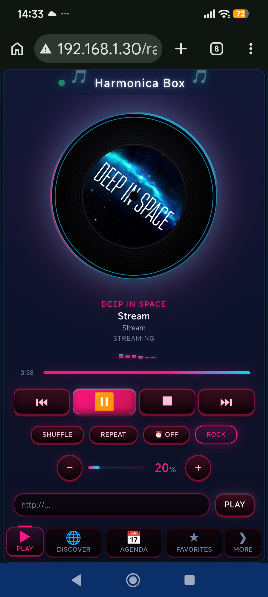
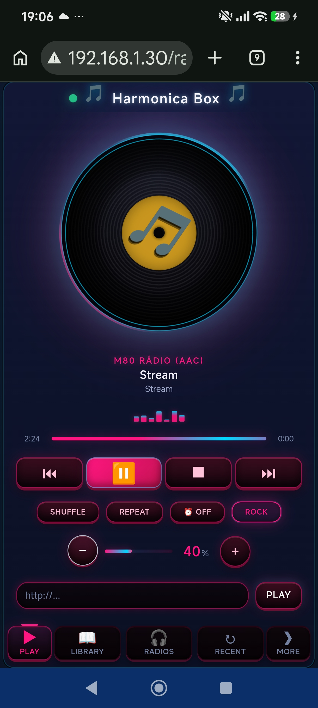
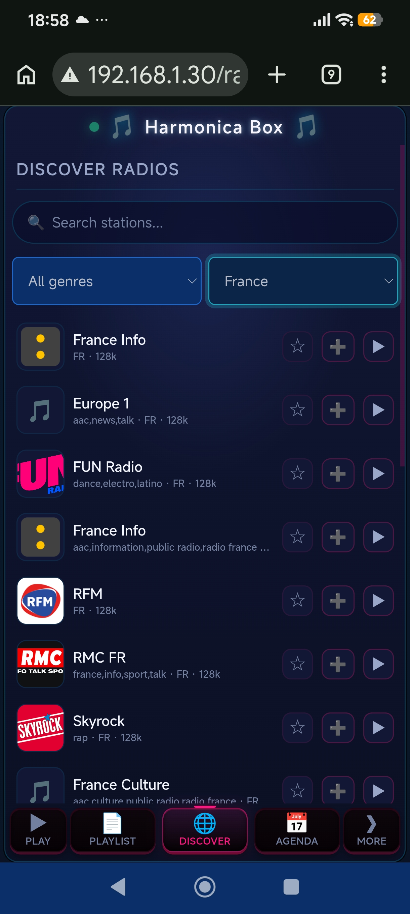
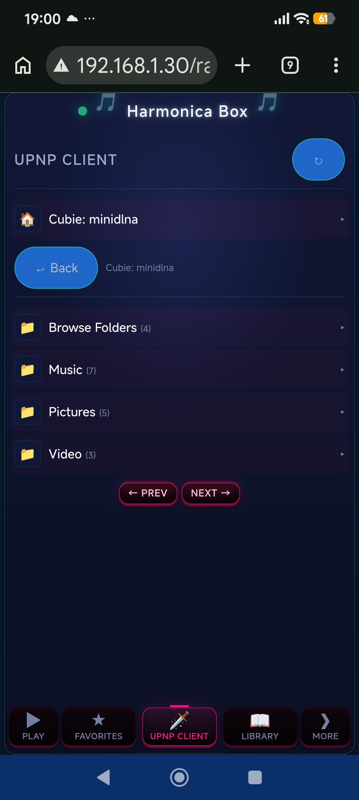

# Harmonica Box

**Internet radio and music streaming firmware for ESP32-S3 N16R8** — part of the [Node32-HUB](https://github.com/nasp2000/Node32-HUB) project.

> ⚠️ Current release targets **ESP32-S3 N16R8 only**.

Streams internet radio and MP3 files through a **UDA1334A I2S DAC** amplifier, with online station discovery, favorites, playlists, UPnP client, and a full-screen web player. The player runs entirely in the browser — zero server load, the ESP32 only decodes and streams audio.

<table>
  <tr>
    <td></td>
    <td></td>
    <td></td>
    <td></td>
  </tr>
</table>

📷 [More screenshots](image/)

---

## Features

### Streaming
- **Internet radio** — play any MP3 stream URL, with online station search, genre and country filters
- **SD card library** — primary storage. MP3 files in `/library` on the SD card are browsable and playable from the web UI
- **PSRAM** — fallback when no SD card is present. Upload files via the web UI to the board's built-in PSRAM. Contents are lost on reboot.
- **UPnP client** — discover and browse media servers on the local network

### Playback
- **UDA1334A I2S DAC** — buffered MP3 decoding (minimp3) to your amplifier or speakers
- **Queue** with shuffle and repeat modes (Repeat 1 / Repeat all)
- **Favorites** — save and quickly play your preferred stations
- **Playlists** — save, load and delete named playlists
- **Equalizer** — adjustable gain bands
- **Sleep timer** and station artwork display

### Web UI (`/radio-ui`)
The player runs entirely in the browser — all rendering, data processing, and controls are done locally. The ESP32 only decodes and streams audio.

- Full-screen player with volume, play/pause, stop, next, previous, and seek
- **Discover Radios** — search online stations by name, genre or country
- **Playback** tab with queue, shuffle, repeat, equalizer and volume
- **Library** tab for SD card music files
- **Playlist** tab to manage saved playlists
- Stream URL entry for direct playback
- **Alarm clock** — weekly schedule slots that auto-play a source at a chosen time and stop later (days, start/end time, source, volume)

### Reliability
- Watchdog timer and crash recovery
- HTTP Basic Authentication for web access
- OTA updates for remote firmware upgrades
- NTP time synchronization

---

## Hardware Recommendation

[**ESP32-S3 CAM N16R8**](https://www.aliexpress.com/w/wholesale-esp32-s3-cam-n16r8.html) — with onboard micro SD card slot.

The only tested class of board. Pair it with a **UDA1334A I2S DAC** amplifier module. Without the micro SD card the player still works — music plays via PSRAM (no SD playback).

### Wiring (UDA1334A I2S DAC)

```
ESP32-S3 N16R8          UDA1334A              Amplifier/Speakers
─────────────────       ─────────────         ──────────────────
3.3V                ───  VIN
GND                 ───  GND
GPIO41 (BCLK)       ───  BCLK
GPIO42 (WSEL/LRCK)  ───  WSEL
GPIO19 (DIN)        ───  DIN
GPIO1  (MUTE)       ───  MUTE   (optional, LOW = audio active)
                    LOUT ───────────────────  AUX IN L
                    ROUT ───────────────────  AUX IN R
                    GND  ───────────────────  AUX GND
SMT                 ───  GND   (de-emphasis off)
SF0                 ───  GND   (I2S format, 00)
SF1                 ───  GND
```

> MCLK is not connected — the module derives the clock from BCLK internally. The micro SD card (onboard TF slot) uses SDMMC 1-bit (CMD=38, CLK=39, D0=40) and is handled automatically.

---

## Quick start

1. Flash the pre-built binary to your ESP32-S3 N16R8 (binaries in Releases) using [webflasher_Node32-HUB](https://github.com/nasp2000/webflasher_Node32-HUB). For future updates use **OTA** at `http://<esp32-ip>/ota`
2. Connect the **UDA1334A I2S DAC** to your amplifier/speakers
3. Open `http://harmonica-box.local` in a browser (mDNS) or `http://<esp32-ip>` and go to **Radio**
4. Play a stream URL or a station from **Discover Radios**

---

## First Access

1. Flash the pre-built binary
2. Wait for AP **NODE32-HUB**
3. Connect with password **12345678**
4. Browse to `http://192.168.4.1`
5. Login with user **root** / password **root**
6. Go to **Settings → Wi-Fi** and connect to your local network
7. Once connected, the AP turns off automatically and the device is reachable at `http://harmonica-box.local` (mDNS) or the assigned IP

> If the device loses connection to the Wi-Fi network, it reactivates AP mode automatically.

---

## License

Same as Node32-HUB — see the [main repository](https://github.com/nasp2000/Node32-HUB).
